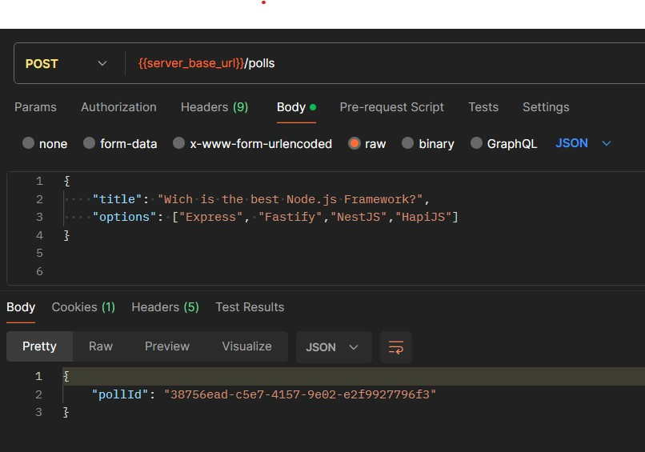
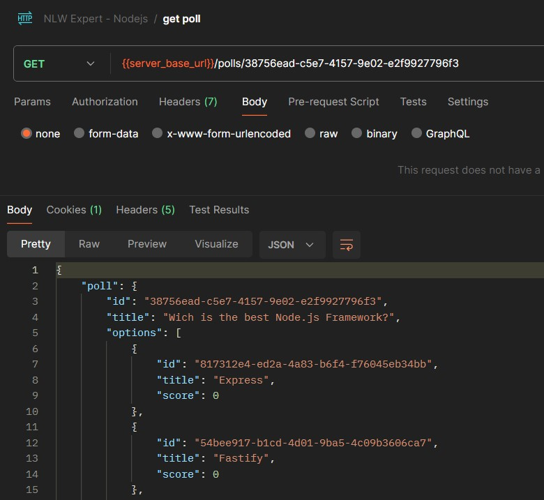
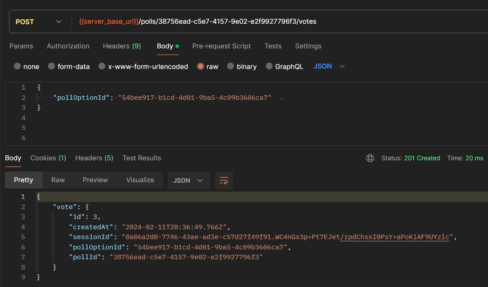
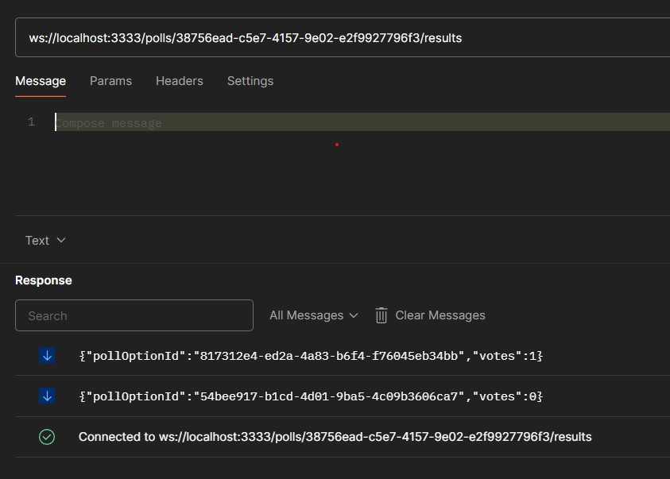

# NLW Expert - Node.js

<div align="center">
  
  
</div>
<br>
<p align="center">


<br>


</p>

## About

This project was proposed by Rocketseat in <strong>Next Level Week Expert - Node.js track</strong>. The challenge involves the development of the backend for a polling application with data stored using PostgreSQL and Prisma ORM, vote count stored with Redis for quick retrieval, and real-time feedback to connected clients through websockets.

## How to Run

You will need Node.js and Docker installed on your machine.

```bash
# create .env file based on .env.example
cp .env.example .env
```

```bash
npm i
docker compose up -d
npx prisma migrate dev
npm run dev
```

## How to test

Use any tool to test APIs, like Postman, Insomnia or Hoppscotch.

Test the endpoints as per the examples below, where `server_base_url` is the same as `localhost:3333`.

### Create a Poll

`/polls`: Pass data with `title` and `options` in the body:

</img>

### Get Poll Data

`/polls/:pollId`: Pass pollId as queryParam

</img>

### Vote on Poll

`/polls/:pollId/votes`: Vote on a poll using pollId as queryParam and `pollOptionId` in the body

</img>

### Realtime Feedback

`/polls/:pollId/results`: Connect to a poll WebSocket Channel with its Id

</img>

## Useful Commands:

### Docker

```bash
# Run docker in detached mode
docker compose up -d

# list containers
docker ps

# Show logs of a container execution
docker logs <container_id>

# stop execution of a container
docker kill <container_id>
```

### Prisma

```bash
# starts a project with prisma
npx prisma init

# applies database migrations in the development environment
npx prisma migrate dev

# opens a GUI to explore and manage your database data
npx prisma studio
```
